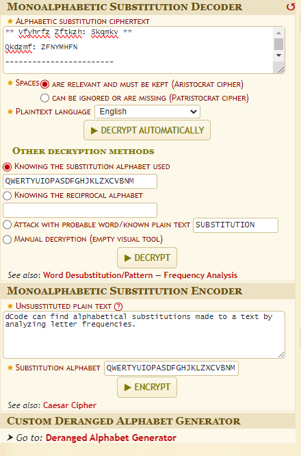
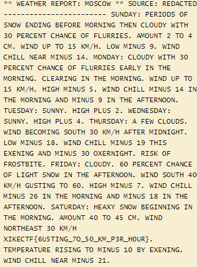

# Deep Cover
```
points: 100
text:
As the Viking ship sailed across the vast North Sea, its crew encountered unexpected turbulence in the form of a message. Amidst the rugged expanse of the waters, a messenger bird descended, bearing a weather report inscribed in Cyrillic script. With furrowed brows, the Norsemen deciphered the ominous tidings, seeking the hidden meaning within.
```

we have a file where a cypher is applied where the following is written inside the following cyphertext

```
** Vfyhrfz Zftkzh: Skqmkv **

Qkdzmf: ZFNYMHFN

------------------------

Qdanyx: Tfzbknq kg qakv fanbao pfgkzf skzabao hrfa mlkdnx vbhr 30 tfzmfah mryamf kg gldzzbfq. Yskdah 2 hk 4 ms. Vban dt hk 15 us/r. Lkv sbadq 9. Vban mrbll afyz sbadq 14.

Skanyx: Mlkdnx vbhr 30 tfzmfah mryamf kg gldzzbfq fyzlx ba hrf skzabao. Mlfyzbao ba hrf skzabao. Vban dt hk 15 us/r. Rbor sbadq 5. Vban mrbll sbadq 14 ba hrf skzabao yan sbadq 9 ba hrf yghfzakka.

Hdfqnyx: Qdaax. Rbor tldq 2.

Vfnafqnyx: Qdaax. Rbor tldq 4.

Hrdzqnyx: Y gfv mlkdnq. Vban pfmksbao qkdhr 30 us/r yghfz sbnaborh. Lkv sbadq 18. Vban mrbll sbadq 19 hrbq fcfabao yan sbadq 30 kcfzaborh. Zbqu kg gzkqhpbhf.

Gzbnyx: Mlkdnx. 60 tfzmfah mryamf kg lborh qakv ba hrf yghfzakka. Vban qkdhr 40 us/r odqhbao hk 60. Rbor sbadq 7. Vban mrbll sbadq 26 ba hrf skzabao yan sbadq 18 ba hrf yghfzakka.

Qyhdznyx: Rfycx qakv pfobaabao ba hrf skzabao. Yskdah 40 hk 45 ms. Vban akzhrfyqh 30 us/r cbufMHG{6d5hbao_7k_50_US_t3z_r0dz}. Hfstfzyhdzf zbqbao hk sbadq 10 px fcfabao. Vban mrbll afyz sbadq 21.
```

I want the writeup to be as close to people who have recently started so I will be very simple and detailed .
We have a cyphertext where we can see that there is something that is similar to the flag cbufMHG{6d5hbao_7k_50_US_t3z_r0dz} 

what we can do ? 

**try a bunch of stuff on cyberchef or dcode**

why?

becouse when u are in situation like this one it's a lot of guessing .

Soooo my steps were these:

1. rot13
2. vigenere with this key ZFNYMHFN
3. **monoalphabetic substitution cypher**

the 3 was the right path , so i suggest [dcode](https://www.dcode.fr/monoalphabetic-substitution) to attack these types of challenges , now it's ez we copy paste the ciphertext in to decode ,click on decrypt automatically  and boom magic we have the full text



having the following plaintext it s obv that this is not the right flag we need to repect upper/lower case letters and substitute the X with v for this flag:

```
vikeCTF{6u5ting_7O_50_KM_p3r_h0ur}
```


