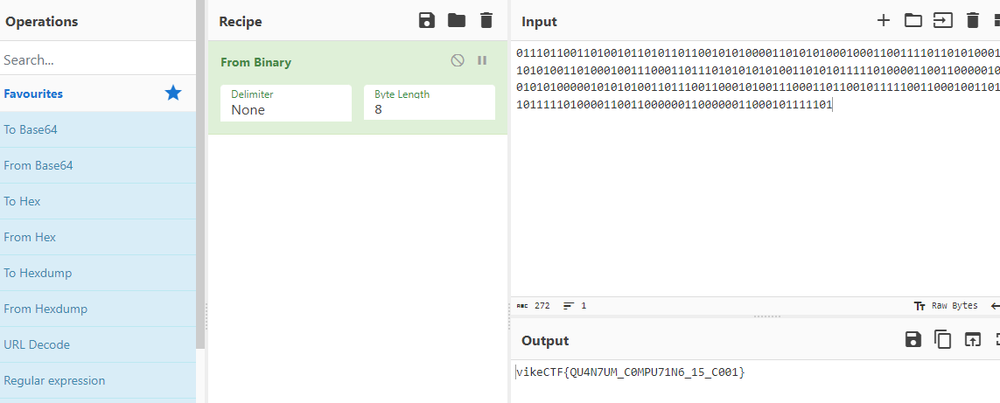

# Quantum Keygen

```
points:400

text: usless
```

This challenge is a lot of guessing :

this challenge was very strange, it's not difficult, it's simply confusing, we have a file that is characterized by 3 strings, one binary and the other two made up of "HX" chars, Actually the first thing that came to mind was comparing the three strings since they are of equal length. I thought perhaps when the two strings composed of H and it has to come out and the only way is through that string.

this is the script

```python
k="110101...."
x="XHXHHX...."
y="HXHXHH...."

for i in range(0,len(x)):
    if x[i]==y[i]:
        print(k[i],end="")
```

we obtain the following string and use cyberchef again :

```
01110110011010010110101101100101010000110101010001000110011110110101000101010101001101000100111000110111010101010100110101011111010000110011000001001101010100000101010100110111001100010100111000110110010111110011000100110101010111110100001100110000001100000011000101111101
flag:vikeCTF{QU4N7UM_C0MPU71N6_15_C001}
```



