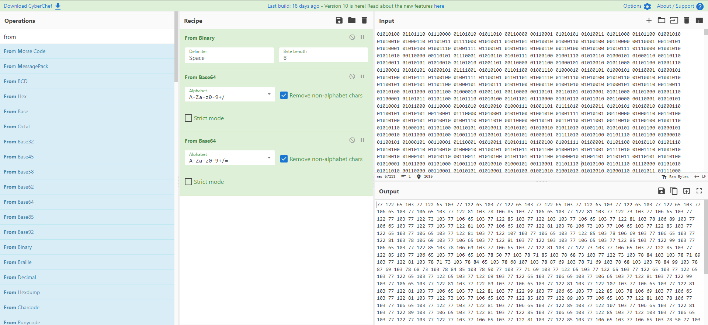
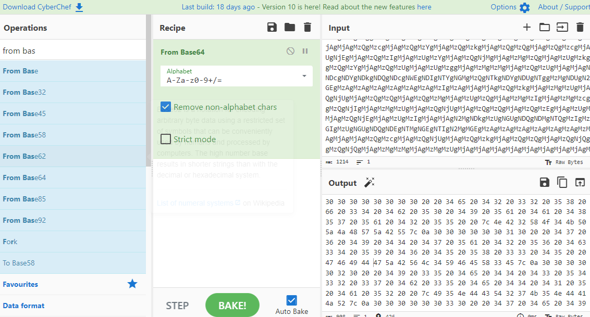
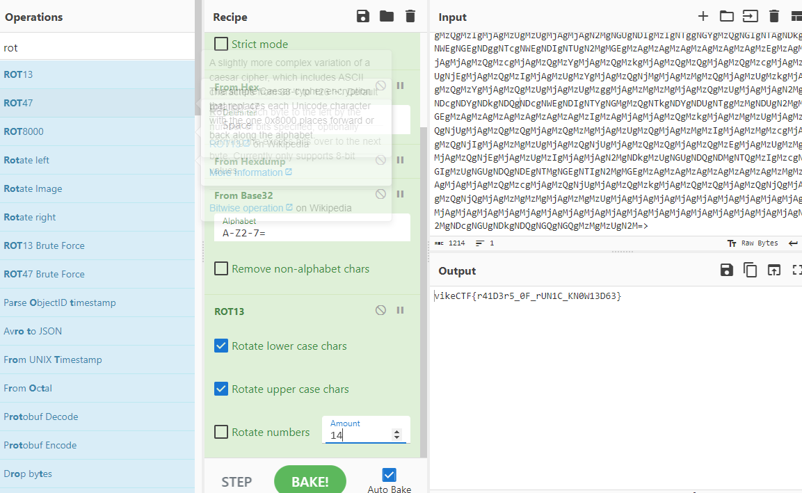

# Norse Cryptogram
```
points: 100
text:
Delve into the realm of Norse mythology and unlock the secrets of the runic script in this cryptic challenge. Armed with your wits and keen eye, decrypt the ancient messages hidden within the runes. Will you prove yourself worthy of Odin's wisdom or fall prey to the tricks of Loki? Prepare to embark on a journey through Viking lore as you unravel the Runebound Riddles!
```

we have a file where a cypher is applied where the following is written inside the following cyphertext

this is the same methodology of the last challenge basically **cyberchef is gonna carry us** just put inside and click the magic wand. 



convert these numbers to letters we obtain this garbage but don't worry **cyberchef is gonna carry us again**
 


 ***magnificent**! now click on the wand and use rot13*

 

 cyberchef: full carry gg ez 